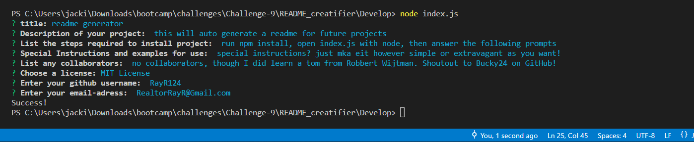

# readme generator

## Description
this will auto generate a readme for this and any future projects! Simply open the file, rune node and index.js, and follow the prompt in the terminal. Be as specific or vague as you like! The README will be generated for you and will be saved in the appropriate folder!

## Table of Contents
- [Installation](#installation)
- [Usage](#usage)
- [Credits](#credits)
- [Contribution](#contribution)
- [Tests](#tests)
- [License](#license)

## Installation
Simply run npm install, open index.js with node, then answer the following prompts. It's that easy!

## Usage
Special instructions? Just make it however simple or extravagant as you want! Obviously the more detailed information you have included, the better, but it's your README, you can put however much effort you want into it!

Follow this link: https://drive.google.com/file/d/1acTCWtJnimmwIfU9gd-4k2W8zkhKvZ6F/view to view a video walkthrough of the README Creatifier in action!

## Credits
No collaborators on this project, though I did learn a TON from Robbert Wijtman in the bootcamp where he taught us as a class on how to do exactly this. Shoutout to Bucky24 on GitHub!

## License
Licensed under <a href="https://opensource.org/licenses/MIT/">MIT License<a>.
See https://opensource.org/licenses/MIT/ for more information.

## Questions?

github handle: RayR124 - visit my profile: https://github.com/RayR124 
Contact me at RealtorRayR@Gmail.com if you have any additional questions!